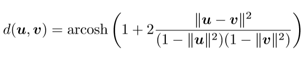
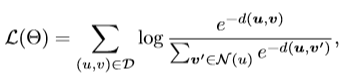
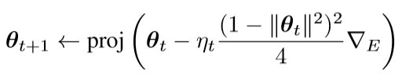
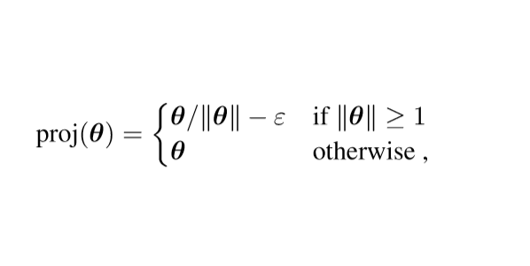

# ML2-Poincare-Embedding

This repository is a simple implementation of [Poincaré Embeddings for Learning Hierarchical Representations](Poincare_Embedings_for_Learning_Hierarchical_Representation.pdf) paper introduced by Maximilian Nickel and Douwe Kiela at Facebook AI Research.

## Summary

This paper introduced an interesting model to learn vector representation of nodes in a graph.
It takes a list of relations between nodes such as:

```
	dataset = [[banana fruit], [eatable_fruit fruit]]
```

Afterward, it attempts to learn the dataset vector representation such that the distance between nodes' vectors accurately represent how close the nodes are in the graph.

The novality of this paper is by introducing a new approach for learning hierarchical representations of the nodes by embedding them into hyperbolic space, or more precisely into an n-dimentional Poincare ball.
The reason presented for this is that hyperbolic spaces are more suitable for capturing hierarchical and similarity information of nodes, as opposed to the commonly used Euclidean space.
For more insights in understanding the following contents, please refer the paper above.

### Distance Function

The model calculates the distances between two nodes' vectors through the following equation:



Where:
	
&nbsp;&nbsp;&nbsp;**<em>u, v</em>** are multi-dimentional vectors of any two words in the dataset.

The distances within the Poincare ball changes smoothly with respect to the location of the **<em>u</em>** and **<em>v</em>** vectors.
This locality property of the Poincare distance is key for finding continous embeddings of hierarchies.
For nodes close to the Poincare ball boundary, their distances to other nodes is relatively low in the Euclidean space terms.

### Loss Function

The paper mentioned the following equation:



Where:

&nbsp;&nbsp;&nbsp;**<em>N(u)</em>** is a set of negative examples (nodes not related to the node **<em>u</em>**).
The paper suggests to sample 10 negative examples per positive example for training.
This loss function minimizes the distance between connected nodes and maximizes the distances between unconnected nodes.

### Optimization

The paper presented the following equation in order to optimize the model embeddings:



where:

&nbsp;&nbsp;&nbsp;**<em>proj(θ)</em>** constrain the embeddings to remain within the Poincare ball via the following equation:

	


## Repository Contents

This repository contains the following:

1. [Poincaré embeddings for learning hierarchical representations paper](Poincare_Embedings_for_Learning_Hierarchical_Representation.pdf)
2. Sample data to train /data
3. implementation codebase **<em>pytorch_scripts.py</em>** and **<em>prog.py</em>**


## Training and Testing the Model

In order to run and train the model, you have to make sure the following libraries are installed in your python3 version:

1. Pytorch
2. NLTK
3. Matplotlib

Th repo generates a pair of related words list file of **<em>(.tsv)</em>** extension imported from WordNet library.
However, you may generate a list of word pairs file of **<em>(.tsv)</em>** extension in your own by saving it in the **<em>data/</em>** folder to be fed to the model.

Once all is set, refer the **<em>prog.py</em>** script file and alter the following variable which should match the created file name in the **<em>data/</em>** folder.
There is several other parameters that you may update in the prog.py file depending on your own preference.

### Examples

Setting the follwing variable as it shown below, will generate a similar result of the following graph:

1. Example (A)
```
	word = 'brown'
```


2. Example (B)
```
	word = 'fruit'
```


##Contributors

[Ali Moallim](mailto:axj.159@gmail.com)

## License

GNU GENERAL PUBLIC LICENSE


